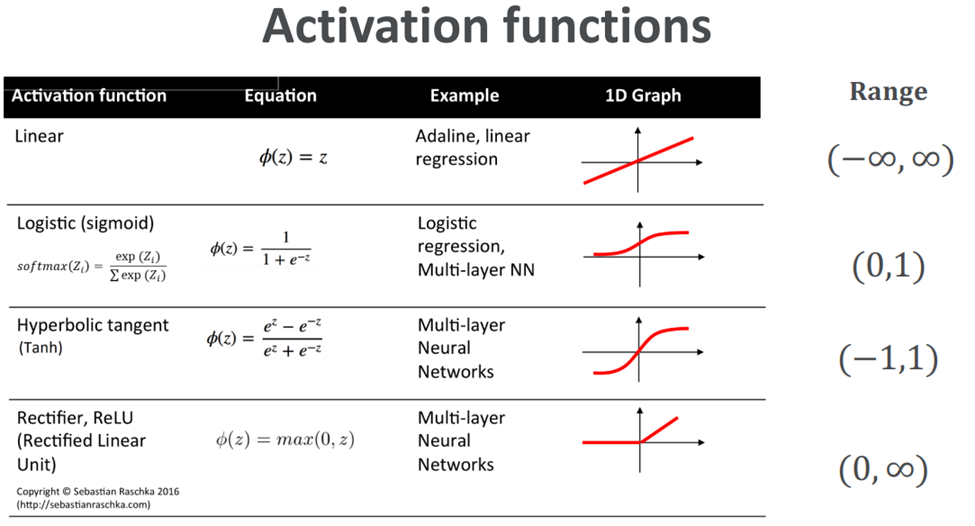

# ML-Information

 
การเลือกใช้ตามปัญหาที่ต้องการ

 - ปัญหา Classification 
    - เกี่ยวกับการจัดหมวดหมู่ เช่น จัดหมวดหมู่คำ
    - Activation จะเกี่ยวกับตัวเลขที่มีขอบเขตชัดเจน
        - Sigmoid โดยจะใช้กับการวิเคราะห์ว่าใช้หรือไม่ เกิดหรือไม่เกิด
        - Binary Crossentropy : Binary จะมีค่าแค่ 0 กับ 1
        - Multi label , multi class
        - Softmax จะเป็นการวิเคราะห์โดย output ทั้งหมดรวมกันจะได้ 1 แนวเดียวกับ Sigmoid แต่จะเห็นเป็นอัตราหรือ % แบบชัดเจน
        - Sparse_categorical_crossentropy
        - Multi class
        - ช่วงดูตามรูปในส่วนของ Range
    - Loss
        - Binary Crossentropy
        - Sparse Categorical Crossentropy
     
 - ปัญหา Regression 
    - เกี่ยวกับการทำนาย เป็นเชิงตัวเลข เช่น การคำนวณแนวโน้มราคาสินค้า
    - Activation ตัวเลขที่ไม่มีขอบเขตชัดเจน
        - Linear ใช้สำหรับตัวเลขที่ต้องการ
        - ReLU ใช้สำหรับตัด input ที่น้อยกว่า 0
        - ช่วงดูตามรูปในส่วนของ Range
    - Loss
        - Mean Squared Error

 

  